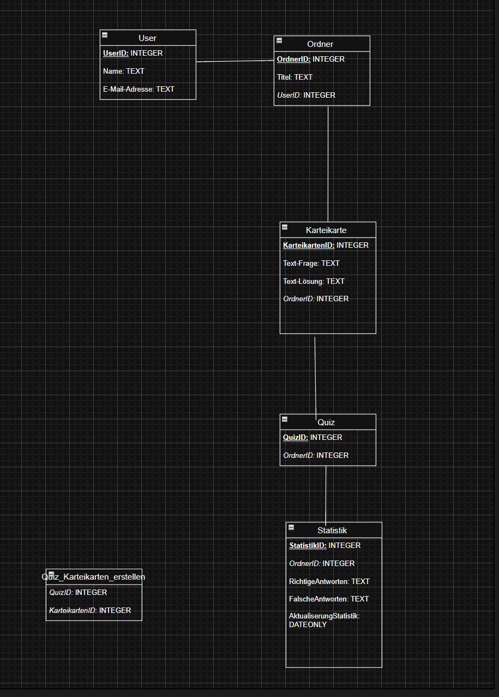

# **NeuroCards**

## Projektgruppe: Aleksandra Vidovic & Tamara Kaselj
## Klasse: 3AHIF
## Jahr: 2026

# Link Repository: https://github.com/aleksandra217/DBI_Projekt_Aleksandra_Vidovic_Tamara_Kaselj.git

## Betreuer: David Bechtold, Christoph Bauer                                                                                  
## Kurzbeschreibung: WIr erstellen ein Programm, wo man einen Ordner erstellen kann und dadrinnen kann man Karteikarten (offene Fragen, Multiple Choice, True/False) erstellen. Daraus lässt sich dann ein Quiz erstellen und dann sieht man eine Statistik, wo man auch sieht, wie viele Fragen man richtig und wie viele Fragen man falsch hatte.  

Collage mit mindestens zwei Screenshots 

 

2	Projektzeitplan
| Datum | Aufgabe | Bearbeiter | Status (%) |
| ----------- | ---------- | ---------- | ---------- |
| 28.05.2026 | Beginn den Users in der FastAPI aufzubauen | Aleksandra Vidovic | 70 % |
| 31.05.2026 | Users in der FastAPI fertig programmiert, Fehler waren vorhanden | Aleksandra Vidovic | 100 % |
| 01.06.2026 | Fehler bei Users wurden behoben | Aleksandra Vidovic | 100 % |
| 01.06.2026 | Ordner in der FastAPI programmieren | Aleksandra Vidovic | 70 % |
| 02.06.2026 | Ordner wurde in der FastAPI fertig programmiert | Aleksandra Vidovic | 100 % |
| 03.06.2026 | Karteikarten wurden in der FastAPI programmiert | Aleksandra Vidovic | 100 % |
| 03.06.2026 | Code von allen `model.py` Dateien in eine gemeinsame `model.py` hinzugefügt | Aleksandra Vidovic | 100 % |
| 08.06.2026 | Quiz wurde fertig erstellt | Tamara Kaselj | 100 % |
| 08.06.2026 | Statistik wurde fertig erstellt | Tamara Kaselj | 100 % |
| 10.06.2026 | Bei der Statistik erhält man eine Ausgabe. Fehler wurde behoben | Aleksandra Vidovic | 90 % |
| 10.06.2026 | Datenbank wurde fertig gestellt | Tamara Kaselj | 100 % |
| 11.06.2026 | Fehler bei Users POST-Login gelöst | Aleksandra Vidovic | 100 % |
| 11.06.2026 | Fehler bei GET und POST von Ordner gelöst | Aleksandra Vidovic | 100 % |
| 11.06.2026 | Fehler beim zweiten GET `ordnerid` gelöst, somit hat auch PUT funktioniert | Aleksandra Vidovic | 100 % |
| 11.06.2026 | Fehler bei Karteikarten gelöst, außer beim ersten GET, wo man alle Karteikarten erhält | Aleksandra Vidovic | 80 % |
| 11.06.2026 | Fehler bei Quiz bei POST, GET, GET id und DELETE gelöst. Zwei müssen noch gelöst werden. | Aleksandra Vidovic | 60 % |
| 11.06.2026 | Logging wurde fertig gestellt | Tamara Kaselj| 100 % |
| 11.06.2026 | Fehler bei Statistik gelöst | Aleksandra Vidovic | 100 % |
| 12.06.2026 | Pydantic-Models für User, Ordner, Karteikarten, Quiz und Statistik erstellt bzw. angepasst | Tamara Kaselj | 100 % |
| 12.06.2026 | Routes und Endpunkte für User, Ordner, Karteikarten, Quiz und Statistik erstellt bzw. erweitert | Tamara Kaselj | 100 % |
| 12.06.2026 | Endpunkte mit GET, POST, PUT und DELETE getestet und Fehlermeldungen verbessert | Tamara Kaselj | 100 % |
| 12.06.2026 | Verbindung zwischen Quiz und Karteikarten überprüft und fehler behoben | Tamara Kaselj | 100 % |
| 16.06.2026 | Fehler bei Ordner Delete gelöst | Aleksandra Vidovic | 100 % |
| 16.06.2026 | Fehler bei GET Quiz_Karteikarten_anzeigen gelöst | Aleksandra Vidovic | 100 % | 
| 16.06.2026 | Fehler beim POST Quiz_Aus_Karteikarten_erstellen gelöst | Aleksandra Vidovic | 100 % |

3	Lastenheft (Kurzbeschreibung, Funktionsumfang, Skizzen)
2.1. Kurzbeschreibung  
- Ein User kann erstellt werden und der User kann sich sogar nochmals anmelden. Der User kann Ordner erstellen, dadrinnen Karteikarten erstellen, daraus Quizze erstellen und zum Schluss die Statistik erstellen bzw. die Quiz_Auswertung sehen. 

2.2. ERM und RM:
ERM: 

RM: 
 

Must-Haves und Nice-To-Haves beschreiben (Punkteliste). Must-Haves müssen umgesetzt werden.
Must-Haves:
- Mehrere Ordner können erstellt werden.
- Mehrere Karteikarten können erstellt werden.
- Quizze können erstellt werden, gestartet werden und gemacht werden.
- Der User kann sich anmelden -> Login 
- Der User muss sich zuerst registrieren, wenn er noch keinen Account hat. 
- Statistik: Das System speichert immer nach jedem Quiz ab, wie viele Richtige und Falsche Antworten man hatte und auch das Datum -> Aktualisierung. 

Nice-Haves:
- Bei dem Ordner eine Farbe auswählen können. 
- Limit bei Karteikarten setzen. 
- Limit bei Erstellung von Quizzes erstellen. 

- Um unser PyCharm im Terminal starten zu können:
1. cd "DBI_Projekt_Aleksandra_Vidovic_Tamara_Kaselj-main"
2. uvicorn main:app --reload
3. dann kommt die IP Adresse bzw. die URL und dann gelangt man ins Swagger.

 
4	Pflichtenheft 

4.2	Umsetzungsdetails
Detaillierte Beschreibung der Umsetzung mit möglichen Fehlern und Lösungen

|    Datum    |   Fehler   | Lösung | Bearbeiter |
| ----------- | ---------- | ---------- | ---------- |
|  10.06.2026 | überall einen 500 Internal Server Error erhalten | In model.py wurden neue variablen hinzugefügt, die nicht in router.py ergängt worden sind. Wurden ergänzt. Jetzt funktioniert wieder alles. |  Aleksandra Vidovic  |
|  11.06.2026 | Users POST-Login hat nicht funktioniert. 500 Internal Server Error | Bei der Klasse UserLogin, war password statt passwort und in der Zeile 118 bei der if-verzweigung hat die Klammer nach dem if gefehlt, um einzutragen was geprüft werden soll. 
|  11.06.2026 | 500 Internal Server Error bei Ordner | Momentan nur in GET Und POST gelöst | habe eine update_db.py erstellt und gefragt und nachgefragt, wie man das lösen kann und habe den code kopiert und es hat dann farbe und title hinzugefügt | Aleksandra Vidovic |
| 11.06.2026 | 500 Internal Server bei GET - ordnerid | Habe in der base.py die zeile 32 von ordnerid zu userid verändert. Die ID war falsch. | Aleksandra Vidovic |
| 11.06.2026 | 500 Internal Server Error bei Karteikarten | Ich habe in der update_db.py den code verändert mit Hilfe, für Karteikarten | Aleksandra Vidovic | 
| 11.06.2026 | 500 Internal Server Error bei Quiz | Habe in update_db.py mit Hilfe den Code umgeschrieben. Zwei Endpunkte funktionieren noch nicht richtig. | Aleksandra Vidovic |
| 11.06.2026 | 500 Internal Server Error bei Statistik | Habe in update_db.py mit Hilfe den Code umgeschrieben | Aleksandra Vidovic |
| 16.06.2026 | 500 Internal Server Error beim Delete beim Ordner | Neuen Ordner erstellt und dann wieder getestet | Aleksandra Vidovic | 
| 16.06.2026 | Leere Liste zurückbekommen bei Karteikarten das erste GET (Alle Karteikarten erhalten) | Es muss nicht der ordner sondern die frage gesucht werden | Aleksandra Vidovic 
| 16.06.2026 | Leere Liste bei Quiz_Karteikarten anzeigen bekommen | Beim zweiten POST, also das POST Quiz aus Karteikarten erstellen, hat eine quizid und diese quizid muss für das GET genommen werden, um die Karteikarten für das Quiz zu bekommen | Aleksandra Vidovic |
| 16.06.2026 | Beim POST Quiz_Aus_Karteikarten_erstellen hat es immer einen fixen title genommen, obwohl der user einen titel eingeben sollte. | Habe beim quiz in router.py in der funktion ,,quiz_aus_karteikarten_erstellen" den titel in zeile 65 hinzugefügt und in 
80 statt den fixen title, einfach title hingeschrieben | Aleksandra Vidovic |

4.3	Ergebnisse, Interpretation (Tests)
Wie läuft das Programm?
Welche Schwachstellen hat es?   (z.B. Programmlauf nicht flüssig)
- Hat keine Schwachstellen. 
 
5	Anleitung
5.1	Installationsanleitung
Was muss alles installiert werden 
- PyCharm/Python
- requirements.txt (sind verschiedene installationen vorhanden)

5.2	Bedienungsanleitung
Muss so genau sein, dass auch ein neuer, unbedarfter Benutzer damit zurechtkommt.
- Man kann einen Account anlegen -> User erstellen und eine rolle zuweisen. Man kann alle Users erhalten oder mit einer ID. Man kann User löschen und man kann sich nochmals anmelden. Man kann einen Ordner erstellen, löschen, verändern (also den titel), alle ordner oder mit id erhalten. Man kann Karteikarten zum jeweiligen Ordner erstellen, verändern, löschen und alle erhalten oder mit einer id. Man kann ein Quiz dazu erstellen, löschen, titel verändern, alle quizzes oder mit einer id holen. Man kann die Statistik dazu anschauen, also eine erstellen, alle erhalten oder mit einer id und eine quiz_auswertung sehen. 

6	Bekannte Bugs, Probleme
Welche Bugs liegen noch vor? Warum konnten sie nicht behoben werden?
- Es liegen keine Bugs vor. 

 
7	Erweiterungsmöglichkeiten
Wenn ihr noch Zeit hättet, was würdet ihr verbessern oder erweitern?
- Wenn wir noch Zeit hätten, dann würden wir noch ein Limit bei Karteikarten erstellen und ein Limit bei Quiz erstellen setzen.  
 

   
