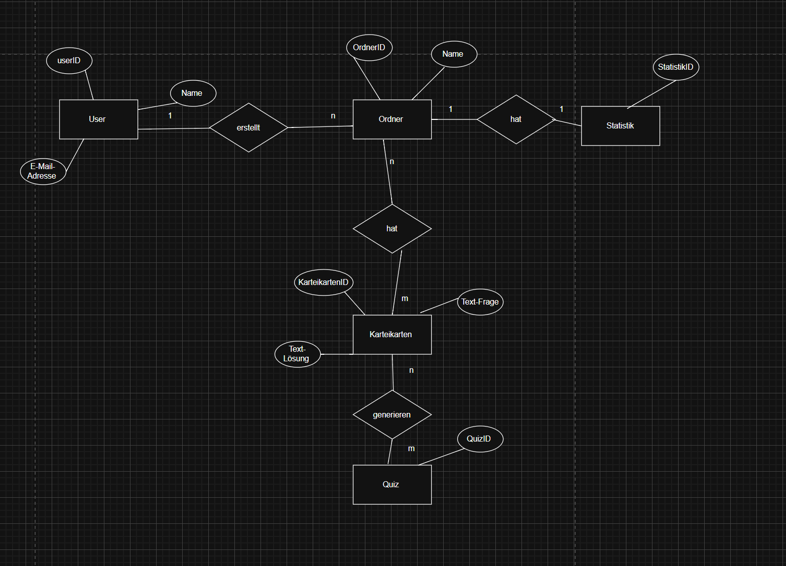
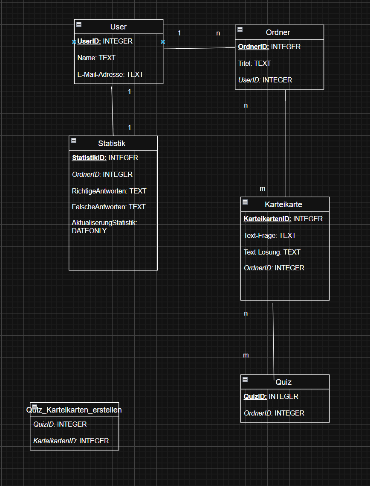

# Planung
## Projektidee: Karteikartensystem 

In unserem Projekt erstellen wir ein Karteikartensystem. Man kann Ordner erstellen und darin Karteikarten speichern. Außerdem kann man Quizze machen und sich eine Statistik anschauen. Es gibt verschiedene Karteikarten-Arten, zum Beispiel Textbox-Karten, Multiple-Choice-Karten und offene Fragen mit Selbstbewertung.

## Ordner: 
- Ein Ordner gehört einem User 
- in diesem Ordner können 0...n Karteikarten erstellt werden /sich im Ordner befinden. 
- in diesem Ordner können 0...n quizzess erstellt werden /sich im Ordner befinden. 

## Karteikarten: 
- Karteikarten gehören zu einem Ordner 
- Es können mehrere Karteikarten erstellt werden. 

## Quiz: 
- Quiz/Quizzes gehören zu einem Ordner. 
- Kann aus mehreren QuizFragen bestehen. 

## Statistik: 
- Die Statistik zeigt dir, deinen Lernfortschritt bzw. den Lernprozess. 
- Statistik ist pro Ordner zu sehen ?

## ERM:

## RM: 

## Must Haves und Nice To Have: #

### Must Have: 
- Ordner kann erstellt werden 
- Karteikarten können erstellt werden
- Quizze können erstellt werden 
- Registrieren und Anmelden ist möglich 
- Statistik pro Ordner sehen ist möglich 

### Nice To Have: 
- Bei dem Ordner eine Farbe auswählen können
- Limit bei Karteikarten setzen
- Limit bei Erstellung von Quizzes erstellen  

## Aufgabenverteilung: Wer macht was? 
Aleksandra: 
- Erstellung der Tabellen in SQLite 
- Datenbank anlegen und Tabellen erzeugen 
- SQL Constraints definieren.
- JOIN Endpunkte
- für die Statistik Aggregrations-Endpunkte
- Testen aller Datenbankabfragen
- Prüfen der Normalisierung

Tamara: 
- FastAPI Grundstruktur 
- CRUD Endpunkte 
- Rollen System einbauen- admin/user 
- Fehlerbehandlungen
- Statistiken und Aggregation entwickeln, also Karten pro Ordner und die Quiz Auswertung. 
- Filter-, Such- und Sortiert-Parameter für GET machen
- Überprüfen der Rollen und Berechtigungen

Beide: 
- Testen aller API Endpunkte
- Konsistenz von Statuscodes und Fehlermeldungen überprüfen. 
- Ordner, Karteikarten, Quizze, Statistik Pydantic Modelle machen.

## Git Repository erstellen: wurde erstellt  

## Was macht jede Tabelle: 
User: 
- Name und Email braucht jeder User.

Ordner: 
- Ordner kann erstellt werden

Karteikarte:
- Karteikarten können erstellt werden und ein inhalt kann reingeschrieben werden.

Quiz:
- daraus können Quizze erstellt werden

Statistik:
- daraus kann man seinen Lernfortschritt anschauen.

## Normalformen nachweisen: 

Tabelle User: 
- 1.NF: Name, E-Mail-Adresse sind atomar. 
- 2.NF: hat einen PK. 
- 3.NF: Name und die E-Mailadresse sind abhänging von der UserID.

Tabelle Ordner; 
- 1.NF: Ist atomar. 
- 2.NF: hat einen PK.
- 3.NF: Titel und UserId hängen vom Ordner ab. 

Tabelle Karteikarte: 
- 1.NF: Text-Frage und Text-Lösung sind atomar. 
- 2.NF: hat einen PK.
- 3.NF: Inhalt der Karteikarte hängt von der KarteikartenID ab.

Tabelle Quiz: 
- 1.NF: Werte sind atomar zueinander.
- 2.NF: hat einen PK. 
- 3.NF: keine abhängigkeiten.

Statistik:
- 1.NF: Werte stehen einzeln in den Feldern. Ist atomar.
- 2.NF: hat einen PK.
- 3.NF: keine abhängigkeiten.

Quiz_Karteikarten_erstellen: 
- 1.NF: Werte sind atomar.
- 2.NF: PK vorhanden.
- 3.NF: Keine abhängigkeiten.

